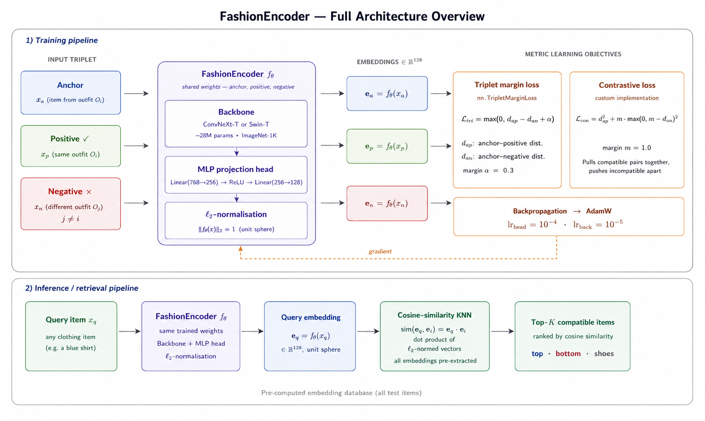

# Fashion Compatibility Learning via Metric Learning and Modern Vision Backbones

**Allizha Theiventhiram** — University of Neuchâtel — allizha.theiventhiram@unine.ch  
**Sandra Nikoloska** — University of Bern — sandra.nikoloska@unibe.ch  
**Boris Verdecia Echarte** — University of Neuchâtel — boris.verdecia@unine.ch

*Deep Learning Course 2026 — University of Bern | Professor: Paolo Favaro*

---

## Research Question

> Can modern general-purpose vision backbones (Swin Transformer, ConvNeXt) learn sufficient
> visual compatibility signals **without explicit type conditioning**, to enable
> compatibility-aware retrieval — reducing the need for type-aware supervision as in prior work?

---

## Overview

A major challenge when building an outfit is knowing how well different clothing items go together.
We frame this as a **metric learning problem**: given images of individual clothing items
(tops, bottoms, shoes), we learn visual embeddings such that compatible items — those belonging
to the same curated outfit — are mapped nearby in the embedding space, while incompatible items
are pushed apart.

$$d(f_\theta(x_i), f_\theta(x_j)) \ll d(f_\theta(x_i), f_\theta(x_k))$$

where $(x_i, x_j)$ is a compatible pair and $x_k$ is an incompatible item.

---

## Repository Structure

```
Deep-Learning-Project/
│
├── FashionCompatibilityLearning.ipynb  # Full pipeline: training, evaluation & analysis
├── DataPipeline.ipynb                  # Dataset loading, exploration & triplet sampling
│
├── fashionencoder.png                  # Architecture diagram
│
├── report_final.pdf                    # Final report (NeurIPS style, 3 pages)
├── report_draft.pdf                    # First draft submitted to professor
│
├── DL_Project_Checkpoints/             # Generated plots (see below)
└── README.md
```

### Generated Outputs (saved to Google Drive)

Running `FashionCompatibilityLearning.ipynb` automatically saves the following:

| File | Description |
|---|---|
| `convnext_tiny__triplet__best.pt` | Best checkpoint — ConvNeXt-T + Triplet (~112 MB) |
| `convnext_tiny__contrastive__best.pt` | Best checkpoint — ConvNeXt-T + Contrastive (~112 MB) |
| `swin_t__triplet__best.pt` | Best checkpoint — Swin-T + Triplet (~111 MB) |
| `swin_t__contrastive__best.pt` | Best checkpoint — Swin-T + Contrastive (~111 MB) |
| `training_curves.png` | Train/val loss per run (2×2 grid) |
| `comparison_bar_chart.png` | AUC & FITB across all 4 runs |
| `loss_effect.png` | Triplet vs Contrastive loss effect |
| `backbone_effect.png` | Swin-T vs ConvNeXt-T backbone effect |
| `similarity_distributions.png` | Compatible vs incompatible cosine similarity distributions |
| `convergence_comparison.png` | All 4 runs convergence overlaid |
| `convnext_tiny__triplet__tsne.png` | t-SNE embedding visualization (best model) |

> Checkpoints are not pushed to GitHub due to file size (~112 MB each).

---

## Dataset

We use **[Marqo/polyvore](https://huggingface.co/datasets/Marqo/polyvore)** from HuggingFace Hub —
a subset of the Polyvore benchmark introduced by Vasileva et al. (ECCV 2018).

| Property | Value |
|---|---|
| Total items | 94,096 |
| Columns | `image`, `category`, `text`, `item_ID` |
| Outfit grouping | Via `item_ID` prefix: `100002074_1` → outfit `100002074` |

### Train / Val / Test Split

We apply an **outfit-disjoint split** (80% / 10% / 10% by outfit ID), ensuring no outfit
appears in more than one split and preventing data leakage.

| Split | Outfits | Items |
|---|---|---|
| Train | 17,269 | 75,255 |
| Val | 2,159 | 9,415 |
| Test | 2,159 | 9,426 |

> **Note:** The official Polyvore-Outfits JSON splits from Vasileva et al. (2018) are not
> compatible with this image subset. Our results serve as order-of-magnitude reference
> relative to the literature baselines.

---

## Method

### Model Architecture: FashionEncoder



A pretrained vision backbone followed by a 2-layer MLP projection head,
outputting **L2-normalized 128-dim embeddings** (see `fashionencoder.pdf` for full diagram).

```
Image → Backbone (ImageNet-1K) → Linear(768→256) → ReLU → Linear(256→128) → L2-normalize
```

### Backbones Compared

| Model | Type | Params | ImageNet Top-1 |
|---|---|---|---|
| **ConvNeXt-T** | Modern CNN | ~28M | 82.1% |
| **Swin-T** | Vision Transformer | ~28M | 81.3% |

### Loss Functions

**Triplet Margin Loss** (`nn.TripletMarginLoss`, margin=0.3):

$$\mathcal{L}_{\text{triplet}} = \max(0,\ d(a,p) - d(a,n) + \alpha)$$

**Contrastive Loss** (custom, margin=1.0):

$$\mathcal{L}_{\text{contr}} = d_{ap}^2 + \max(0,\ m - d_{an})^2$$

### Training Strategy

| Phase | Backbone | Head LR | Epochs |
|---|---|---|---|
| **Phase 1 — Warmup** | Frozen | 1e-4 | 3 |
| **Phase 2 — Fine-tuning** | 1e-5 | 1e-4 | Up to 30 |

Mixed precision (`torch.amp.autocast`) for ~2× GPU speedup.
Early stopping with patience=5 on validation loss.

---

## Results

We ran **4 configurations** (2 backbones × 2 loss functions), evaluated on the **test set**:

| Method | AUC | FITB Acc. | Recall@10 |
|---|---|---|---|
| ConvNeXt-T + Triplet | 0.7035 | **59.4%** ← best FITB | 1.34% |
| ConvNeXt-T + Contrastive | **0.7114** ← best AUC | 51.0% | 0.97% |
| Swin-T + Triplet | 0.7017 | 54.4% | 0.66% |
| Swin-T + Contrastive | 0.6926 | 53.8% | 1.02% |
| Type-Aware (Vasileva et al. 2018)† | ~0.88 | ~57% | — |
| Unsup. Conditions (Tan et al. 2019)† | ~0.91 | ~67% | — |

*† Literature baselines evaluated on official Polyvore-Outfits splits — not directly comparable.*

### Key Findings

1. **Loss function effect is metric-dependent** — contrastive loss wins on AUC (pairwise binary ranking), triplet loss wins on FITB (set-level item selection). No single loss dominates across all metrics.
2. **ConvNeXt-T slightly outperforms Swin-T** on both AUC and FITB on average, but differences are small — suggesting the training signal matters more than backbone choice at this scale.
3. **FITB 59.4% approaches the type-aware baseline (~57%)** without any type supervision — directly supporting our research hypothesis.
4. **Recall@10 is inherently low** (~1%) due to small outfit sizes (2–4 items per outfit), not model failure. Even a perfect model would score low under this metric on this dataset.

---

## Evaluation Metrics

| Metric | Description |
|---|---|
| **AUC** | Compatible vs. random pairs scored by cosine similarity |
| **FITB** | Select correct missing item from 4 candidates given outfit context |
| **Recall@10** | Fraction of truly compatible items in top-10 retrieved results |

---

## How to Run

### Requirements

```bash
pip install datasets torch torchvision Pillow numpy pandas matplotlib tqdm scikit-learn
```

### 1. Data Pipeline (optional — for exploration)

Open `DataPipeline.ipynb` in Google Colab.
Loads the dataset, visualizes outfit structure, and verifies the triplet sampling pipeline.

### 2. Full Pipeline (training + evaluation)

Open `FashionCompatibilityLearning.ipynb` in Google Colab:

1. `Runtime → Change runtime type → L4 GPU → Save`
2. Run all cells top to bottom — **no manual changes needed**
3. All 4 experiments run automatically (~3–4 hours on L4 GPU)
4. Checkpoints and all plots saved automatically to Google Drive

---

## References

1. Vasileva et al. — *Learning Type-Aware Embeddings for Fashion Compatibility*, ECCV 2018 — [arXiv](https://arxiv.org/pdf/1803.09196)
2. Tan et al. — *Learning Similarity Conditions Without Explicit Supervision*, ICCV 2019 — [arXiv](https://arxiv.org/pdf/1908.08589)
3. Sarkar et al. — *OutfitTransformer: Learning Outfit Representations for Fashion Recommendation*, WACV 2023 — [arXiv](https://arxiv.org/pdf/2204.04812)
4. Liu et al. — *Swin Transformer: Hierarchical Vision Transformer using Shifted Windows*, ICCV 2021
5. Liu et al. — *A ConvNet for the 2020s*, CVPR 2022
